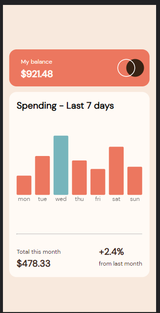

# Frontend Mentor - Expenses chart component solution

This is a solution to the [Expenses chart component challenge on Frontend Mentor](https://www.frontendmentor.io/challenges/expenses-chart-component-e7yJBUdjwt). Frontend Mentor challenges help you improve your coding skills by building realistic projects. 

## Table of contents

- [Overview](#overview)
  - [The challenge](#the-challenge)
  - [Screenshot](#screenshot)
  - [Links](#links)
- [My process](#my-process)
  - [Built with](#built-with)
  - [What I learned](#what-i-learned)
  - [Continued development](#continued-development)
  - [Useful resources](#useful-resources)
- [Author](#author)

## Overview

### The challenge

Users should be able to:

- View the bar chart and hover over the individual bars to see the correct amounts for each day
- See the current day’s bar highlighted in a different colour to the other bars
- View the optimal layout for the content depending on their device’s screen size
- See hover states for all interactive elements on the page

### Screenshot





### Links

- Solution URL: [https://your-solution-url.com](https://github.com/kurokurotho/card.github-io.git)
- Live Site URL: [https://your-live-site-url.com](https://kurokurotho.github.io/card.github-io/)

## My process

### Built with

- Semantic HTML5 markup
- CSS custom properties
- Flexbox
- CSS Grid
- media Query
- JS

### What I learned

In this challenge i do got problem in many places specially for bar graph and using the json file.
I was getting a hard time in arranging the days name but after some little help from commmunity member i was able to do it.
In this challenge I learned how to use json file in my website.

for Making the days name in center & set them below each bars:
```css
span::before{
    
    display: flex;
    justify-content: center;
    content: attr(title);
    position: relative;
    top:100%;
    right: 0;
    left:0;
    opacity: 0.7;
}
```
fetching and using the json file:
```js
fetch('data.json')
.then((resp) => resp.json())
.then((json) => {
  //write your code here
})
```


### Continued development

I would contunue exploring about json and will be using them in future.This was kind of new to me.

### Useful resources
##### FOR THIS CHALLENGE I LOOK UP INTO FEW RESOURCES WHICH HELPED MY A LOT #####
- [Resource 1](https://youtu.be/s6OIOL9OMYA) - This helped me to understand how json is made and used in the html.
- [Resource 2](https://youtu.be/whNFPBEI-wM) - This video contain every thing that we should know about jason.As json was completely new to me it helped me a lot to understand it.
- [Resource 3](https://codepen.io/Victa/pen/kGRyVE) - From here i took the reference to how to make  a bar graph .It was really helpful and was near to design what i wanted.


## Author
- Frontend Mentor - [@kurokurotho](https://www.frontendmentor.io/profile/kurokurotho)

